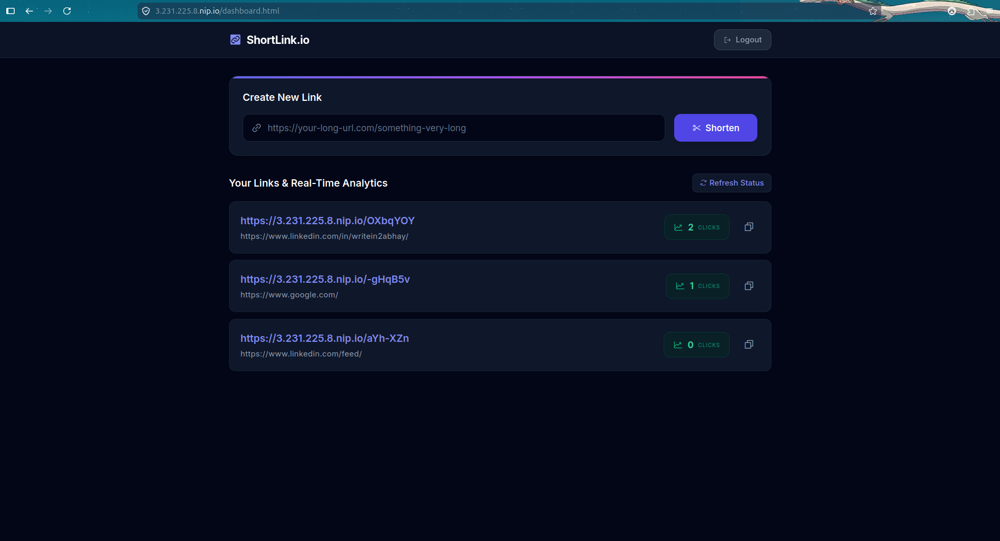
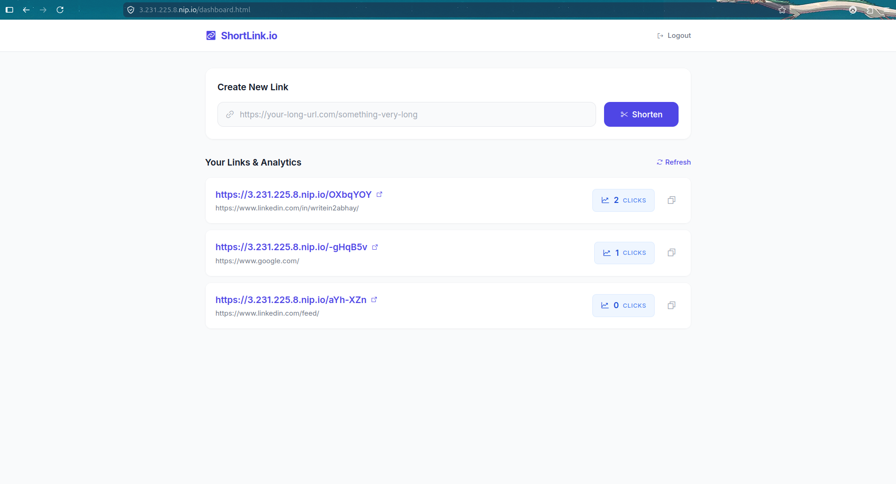

# 🚀 Enterprise-Grade URL Shortener & Telemetry Platform

A production-ready, full-stack URL shortening service engineered with a focus on high availability, security, and NOC-grade observability. Designed and deployed from scratch using AWS infrastructure, containerized microservices, and Infrastructure as Code (IaC) principles.

---

## 📸 Platform Previews

### Modern SaaS Dashboard (Dark Mode)
Designed with a Tailwind CSS-powered UI, featuring contextual analytics, one-click clipboard copying, and asynchronous data fetching.

### Real-Time Analytics & User Interface
Lightweight, fast-loading frontend ensuring zero-latency user experience while securely interacting with the backend API via JWT authentication.

### Enterprise NOC Telemetry (AWS CloudWatch)
Custom CloudWatch dashboard deployed via AWS CLI (`put-dashboard`). Tracks standard (CPU, Network) and custom `CWAgent` metrics (Memory, Root Disk Space) across isolated VPC subnets.

---

## 🏗️ Cloud Architecture & Infrastructure

This project is built on a robust, two-tier AWS Virtual Private Cloud (VPC) architecture ensuring strict separation of concerns and maximum security for the data layer.

### 1. Networking & Security Layer
* **Custom VPC:** Built with logically separated Public and Private subnets.
* **NAT Gateway:** Configured to allow secure outbound internet access for the Private Subnet (Database tier) without exposing it to inbound public traffic.
* **Reverse Proxy & SSL Termination:** Nginx acts as the primary ingress controller, handling rate limiting (`limit_req_zone`), `@backend` fallback routing for short-links, and HTTPS enforcement via Let's Encrypt / Certbot.

### 2. Application Tier (Public Subnet)
* **Node.js API:** Containerized RESTful API running on Docker.
* **Authentication:** JWT-based stateless authentication.
* **Edge Routing:** Handled by Nginx, proxying API requests to `127.0.0.1:3000` while natively serving the static frontend assets to reduce backend load.

### 3. Data Tier (Private Subnet)
* **Dual-Database Approach:** * **MongoDB (NoSQL):** Optimized for high-speed, unstructured key-value lookups (Short Code -> Long URL mapping).
    * **MySQL (Relational):** Ensures ACID compliance for structured user account data and relational constraints.
* **Isolation:** Hosted entirely on the private subnet. Accessible only via the application tier.

---

## 📊 Observability as Code

A core focus of this project is Site Reliability Engineering (SRE) standard monitoring. Instead of manual GUI configuration, the telemetry stack is defined and deployed programmatically.

* **AWS CloudWatch Agent:** Configured via custom JSON files to bypass default dimension limitations, explicitly tagging telemetry with dynamic `${aws:InstanceId}` metadata.
* **IAM Role Management:** Least-privilege IAM policies (`CloudWatchAgentServerPolicy`) attached to EC2 instances.
* **Automated Dashboarding:** A custom bash script utilizes the AWS CLI to push a comprehensive JSON dashboard blueprint, establishing a "Single Pane of Glass" for:
    * Web/API CPU, Memory, and Network I/O.
    * Database CPU, Memory, and strict Disk Capacity warnings (preventing DB corruption).

---

## 🛠️ Key Engineering Challenges Solved

1.  **Nginx Routing for Dynamic Short-Links:** Overcame standard Nginx static file serving limitations by implementing a custom `@backend` fallback location block. If Nginx cannot find a static file matching the short code, it seamlessly proxies the request to the Node container for redirect processing.
2.  **Telemetry Dimension Mismatches:** Debugged silent CloudWatch Agent failures where custom metrics (e.g., `mem_used_percent`) were dropped due to hidden metadata tags (hostname, fstype). Resolved by implementing wildcard `SEARCH()` expressions in the IaC JSON payload.
3.  **Containerized Runtime Integrity:** Diagnosed and patched a dependency failure within the MongoDB driver related to the global Node.js `crypto` module inside the Docker environment by injecting a global polyfill at app initialization.

---

## 💻 Tech Stack Summary

* **Cloud & Infrastructure:** AWS (EC2, VPC, Subnets, NAT Gateway, Security Groups)
* **Observability:** AWS CloudWatch, CloudWatch Agent, AWS CLI (IaC)
* **Web Server:** Nginx, Certbot (SSL/TLS)
* **Backend Application:** Node.js (v18), Express.js, Docker
* **Databases:** MongoDB, MySQL (via Docker Compose)
* **Frontend:** Vanilla JavaScript, HTML5, Tailwind CSS (CDN), Phosphor Icons

---

## 🚀 Future Roadmap

* [ ] **CI/CD Pipeline:** Implement GitHub Actions to automate Docker image builds and push to Amazon ECR.
* [ ] **Terraform Migration:** Port the current infrastructure and CloudWatch dashboard scripts into HashiCorp Terraform modules for immutable state management.
* [ ] **Auto-Scaling:** Migrate the standalone Docker container to Amazon ECS (Elastic Container Service) with Fargate for horizontal scaling based on CloudWatch CPU alarms.

---
*Architected and Deployed by [Abhay-Verma]*